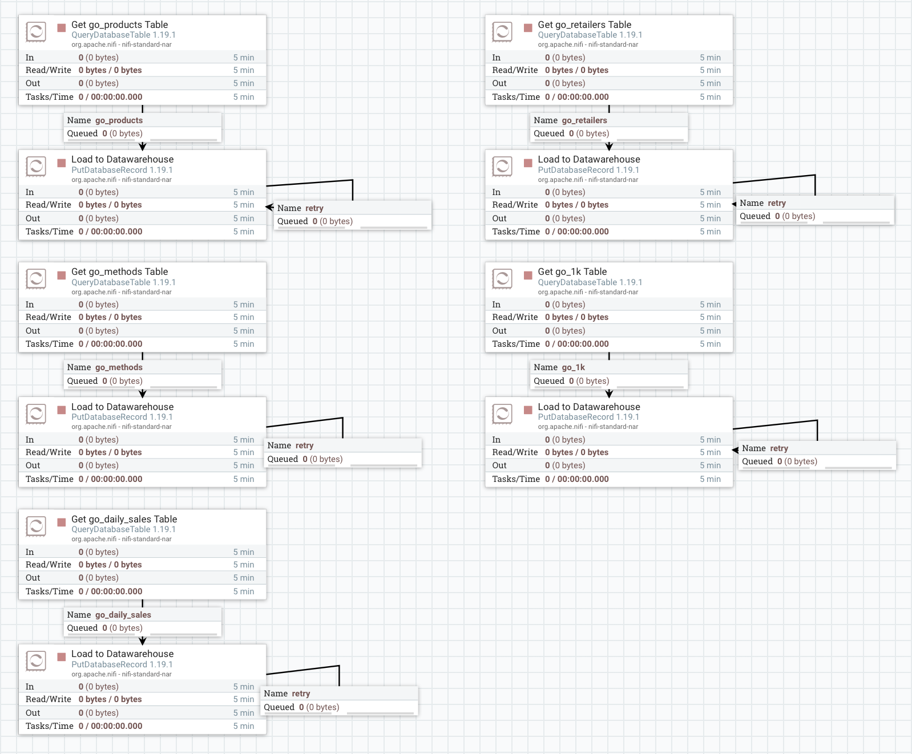
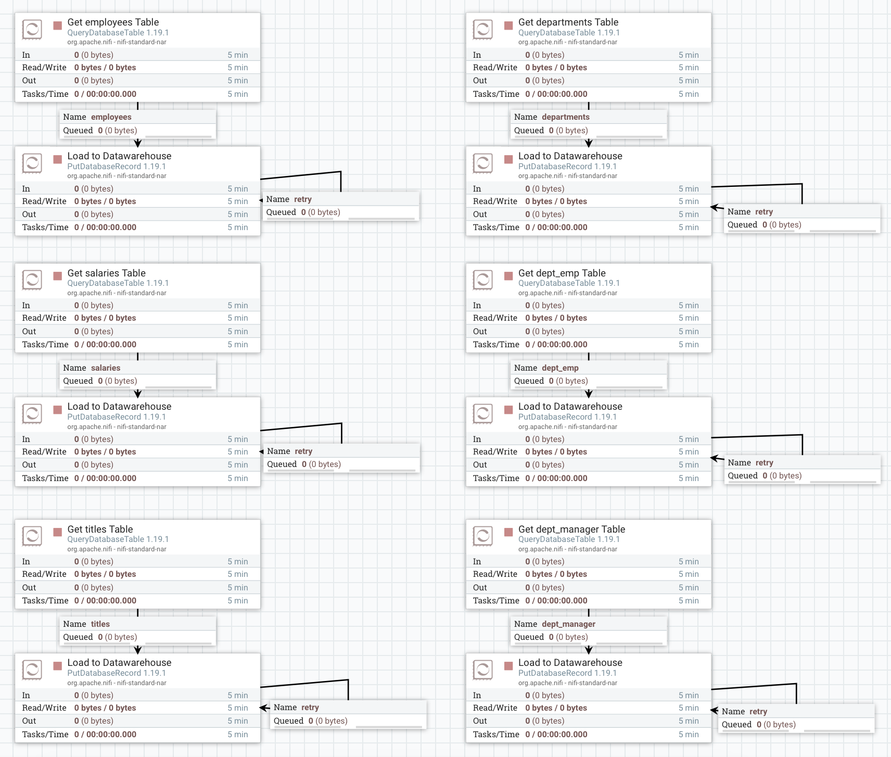
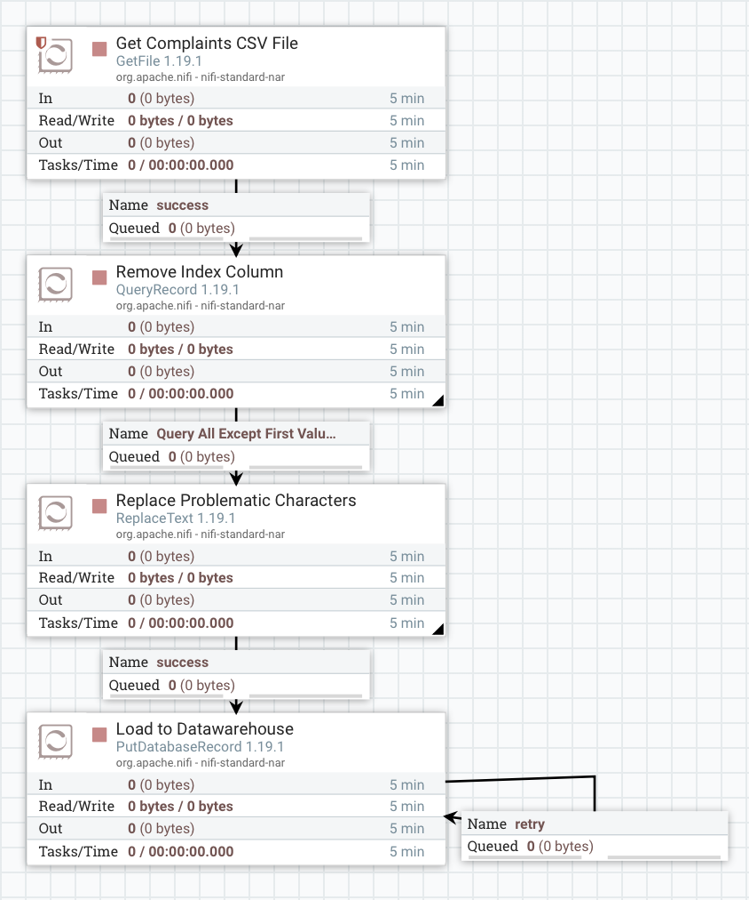
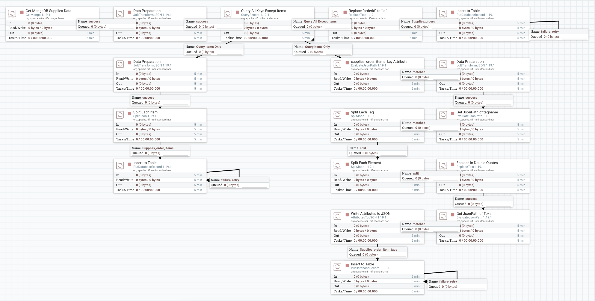

# Building a Datawarehouse with Apache NiFi
Hands-on Activity #1 for the course Advanced Database Systems (STADVDB).

The task is to use an ETL tool such as Apache NiFi to build a centralized datawarehouse from various data sources.

The data sources are: GOSales database (MySQL), Employee database (MySQL), Complaints (CSV File), and Sales (MongoDB Collection).

## To Get Started
NOTE: You must have Docker installed already.

UPDATE: Our team has developed a setup script to automate steps 1-10.
Run the `setup.sh` file in the terminal using the command `./setup` note that the terminal should be in the current directory.

1. Download the files or clone the repository.
2. In the root directory of the folder where the `docker-compose.yml` exists, run the command `docker compose up -d` in the terminal.
This will take some time as all the required image files of Apache NiFi, MySQL Server, and MongoDB Server will be downloaded and installed to your machine.
3. Run the command `docker exec -it advdb_ho1-apache-nifi-1 bash` to enter the Docker container, this will take you to the directory inside the container `/opt/nifi/nifi-current`.
4. Create a new folder called `drivers` using the command `mkdir drivers`.
5. You should now be in `/opt/nifi/nifi-current/drivers` run the command `curl -O https://cdn.mysql.com//Downloads/Connector-J/mysql-connector-j-8.0.32.tar.gz` to get the MySQL Connector/J driver.
6. Run `tar -xzvf` to extract the contents.
7. Open a new terminal tab outside the container, then `cd` to `/ADVDB_HO1/drivers/3.0.7/org/mariadb/jdbc/mariadb-java-client`.
8. Copy the entire folder named `3.0.7` by running the command, `docker cp ./3.0.7 advdb_ho1-apache-nifi-1:/opt/nifi/nifi-current/drivers` this will copy the contents inside the container.
9. Now, back to the Docker container, go to the `data` folder by running `cd /opt/nifi/nifi-current/data`.
10. Run the command `curl -O https://raw.githubusercontent.com/plotly/datasets/master/26k-consumer-complaints.csv`.
11. Connect to the MongoDB server using MongoDB Compass and import the `sales.json` file, the GUI should be straightforward.
12. Enter Apache NiFi by entering `https://localhost:8443/nifi/` in the address bar of your browser.
13. Import the NiFI template `ADVDB_HO1.xml` and you are good to go.

P.S. We should probably write a script to automate all of this for easy replicability but we don't have extra time.

## Process Flow Screenshots
The process flow for the GOSales data source.

The process flow for the Employee data source.

The process flow for the Complaints CSV file.

The process flow for the Sales data source.

